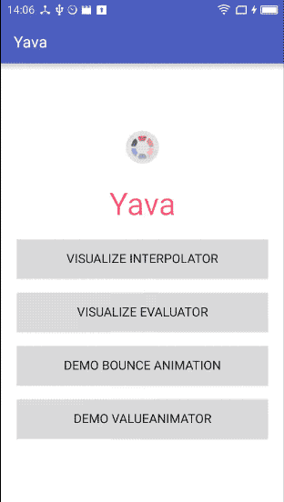

[](https://www.jitpack.io/#hujiaweibujidao/yava)  [](http://android-arsenal.com/details/1/3639)

## Yava

> Yet Another View Animation ( a simple and elegant view animation helper library for Android)    

This library helps you convert any curve into ready-to-use `Interpolator` or `TypeEvaluator` for `ValueAnimator`, and thirty Rovert Penner's Easing Functions are already included.

关于本项目的创建缘由以及实现思路，欢迎阅读我写的这三篇文章，详细介绍了Android动画中的三个重要类：`ValueAnimator`、`TypeEvaluator`和`TimeInterpolator`，我保证您会有所收获的 😜

[当数学遇上动画：讲述`ValueAnimator`、`TypeEvaluator`和`TimeInterpolator`之间的恩恩怨怨(1)](http://hujiaweibujidao.github.io/blog/2016/05/26/when-math-meets-android-animation/)    
[当数学遇上动画：讲述`ValueAnimator`、`TypeEvaluator`和`TimeInterpolator`之间的恩恩怨怨(2)](http://hujiaweibujidao.github.io/blog/2016/05/27/When-Math-meets-Android-Animation-2/)     
[当数学遇上动画：讲述`ValueAnimator`、`TypeEvaluator`和`TimeInterpolator`之间的恩恩怨怨(3)](http://hujiaweibujidao.github.io/blog/2016/05/27/When-Math-meets-Android-Animation-3/)     

该项目实现的功能就是将抽象的函数曲线轻松转换成立即可用的`Interpolator`和`TypeEvaluator`，然后应用在Android动画中。这个项目还提供了常见的30个缓动函数(Easing Functions)的实现，它们既可以当做`Interpolator`来用，又可以当做`TypeEvaluator`来用，真的非常方便。

## Screenshot



## Usage

举个例子，以弹跳动画效果为例，可以直接使用`EasingFunction.BOUNCE_OUT`作为`Interpolator`或者`TypeEvaluator`来使用：

第一种方式：使用线性插值器和自定义的TypeEvaluator

```java
ObjectAnimator animator1 = new ObjectAnimator();
animator1.setTarget(textView1);
animator1.setPropertyName("translationY");
animator1.setFloatValues(0f, -100f);
animator1.setDuration(1000);
animator1.setInterpolator(new LinearInterpolator());
animator1.setEvaluator(EasingFunction.BOUNCE_OUT); //这里将EasingFunction.BOUNCE_OUT作为TypeEvaluator来使用
animator1.start();
```

第二种方式：使用自定义的Interpolator和"线性估值器"

```java
ObjectAnimator animator2 = new ObjectAnimator();
animator2.setTarget(textView2);
animator2.setPropertyName("translationY");
animator2.setFloatValues(0f, -100f);
animator2.setDuration(1000);
animator2.setInterpolator(EasingFunction.BOUNCE_OUT); //这里将EasingFunction.BOUNCE_OUT作为Interpolator来使用
animator2.setEvaluator(new FloatEvaluator());
animator2.start();
```

如果你想使用自己定义的函数来制作动画，可以使用`Functions`的`with`方法，传入一个实现了`IFunction`接口的类就行，返回值你既可以当做`Interpolator`，也可以当做`TypeEvaluator`来使用

代码示例：

```java
ObjectAnimator animator1 = new ObjectAnimator();
animator1.setTarget(textView1);
animator1.setPropertyName("translationY");
animator1.setFloatValues(0f, -100f);
animator1.setDuration(1000);
animator1.setInterpolator(new LinearInterpolator());
animator1.setEvaluator(Functions.with(new IFunction() { //自定义为TypeEvaluator
    @Override
    public float getValue(float input) {
        return input * 2 + 3;
    }
}));
animator1.start();
```

或者这样：


```java
ObjectAnimator animator2 = new ObjectAnimator();
animator2.setTarget(textView2);
animator2.setPropertyName("translationY");
animator2.setFloatValues(0f, -100f);
animator2.setDuration(1000);
animator2.setInterpolator(Functions.with(new IFunction() { //自定义为Interpolator
    @Override
    public float getValue(float input) {
        return input * 2 + 3;
    }
}));
animator2.setEvaluator(new FloatEvaluator());
animator2.start();
```

## Setup

你只需要拷贝`library`中的4个重要类到你的项目中就行了！

或者

1.在项目根目录的`build.gradle`文件中加入

```
allprojects {
    repositories {
        ...
        maven { url "https://www.jitpack.io" }
    }
}
```

2.然后在需要的`build.gradle`文件中加入依赖

```
dependencies {
    compile 'com.github.hujiaweibujidao:yava:1.0'
}
```

## Documentation

项目只有4个核心类，放在`library`中

(1) `IFunction`接口

```java
/**
 * 函数接口：给定输入，得到输出
 */
public interface IFunction {
    float getValue(float input);
}
```

(2)`AbstractFunction`抽象类

```java
/**
 * 抽象函数实现，既可以当做简单函数使用，也可以当做Interpolator或者TypeEvaluator去用于制作动画
 */
public abstract class AbstractFunction implements IFunction, Interpolator, TypeEvaluator<Float> {

    @Override
    public float getInterpolation(float input) {
        return getValue(input);
    }

    @Override
    public Float evaluate(float fraction, Float startValue, Float endValue) {
        return startValue + getValue(fraction) * (endValue - startValue);
    }
}
```

(3)`Functions`类

```java
/**
 * 工具类，将自定义的函数快速封装成AbstractFunction
 */
class Functions {
    private static IFunction function;

    public static AbstractFunction with(final IFunction function) {
        return new AbstractFunction() {
            @Override
            public float getValue(float input) {
                return function.getValue(input);
            }
        };
    }
}
```

(4)`EasingFunction`枚举：包含了30个常见的缓动函数

```java
/**
 * 常见的30个缓动函数的实现
 */
public enum EasingFunction implements IFunction, Interpolator, TypeEvaluator<Float> {

    /* ------------------------------------------------------------------------------------------- */
    /* BACK
    /* ------------------------------------------------------------------------------------------- */
    BACK_IN {
        @Override
        public float getValue(float input) {
            return input * input * ((1.70158f + 1) * input - 1.70158f);
        }
    },
    BACK_OUT {
        @Override
        public float getValue(float input) {
            return ((input = input - 1) * input * ((1.70158f + 1) * input + 1.70158f) + 1);
        }
    },
    BACK_INOUT {
        @Override
        public float getValue(float input) {
            float s = 1.70158f;
            if ((input *= 2) < 1) {
                return 0.5f * (input * input * (((s *= (1.525f)) + 1) * input - s));
            }
            return 0.5f * ((input -= 2) * input * (((s *= (1.525f)) + 1) * input + s) + 2);
        }
    },

    //other easing functions ......

    //如果这个function在求值的时候需要duration作为参数的话，那么可以通过setDuration来设置，否则使用默认值
    private float duration = 1000f;

    public float getDuration() {
        return duration;
    }

    public EasingFunction setDuration(float duration) {
        this.duration = duration;
        return this;
    }

    //将Function当做Interpolator使用，默认的实现，不需要枚举元素去重新实现
    @Override
    public float getInterpolation(float input) {
        return getValue(input);
    }

    //将Function当做TypeEvaluator使用，默认的实现，不需要枚举元素去重新实现
    @Override
    public Float evaluate(float fraction, Float startValue, Float endValue) {
        return startValue + getValue(fraction) * (endValue - startValue);
    }

    //几个数学常量
    public static final float PI = (float) Math.PI;
    public static float TWO_PI = PI * 2.0f;
    public static float HALF_PI = PI * 0.5f;
}
```

## Reference

本项目主要参考了以下项目和内容    
1.[EaseInterpolator](https://github.com/cimi-chen/EaseInterpolator)    
2.[AnimationEasingFunctions](https://github.com/daimajia/AnimationEasingFunctions)       
3.[easings.net](http://easings.net/)     

## License

```
The MIT License (MIT)

Copyright (c) 2016 Hujiawei

Permission is hereby granted, free of charge, to any person obtaining a copy
of this software and associated documentation files (the "Software"), to deal
in the Software without restriction, including without limitation the rights
to use, copy, modify, merge, publish, distribute, sublicense, and/or sell
copies of the Software, and to permit persons to whom the Software is
furnished to do so, subject to the following conditions:

The above copyright notice and this permission notice shall be included in all
copies or substantial portions of the Software.

THE SOFTWARE IS PROVIDED "AS IS", WITHOUT WARRANTY OF ANY KIND, EXPRESS OR
IMPLIED, INCLUDING BUT NOT LIMITED TO THE WARRANTIES OF MERCHANTABILITY,
FITNESS FOR A PARTICULAR PURPOSE AND NONINFRINGEMENT. IN NO EVENT SHALL THE
AUTHORS OR COPYRIGHT HOLDERS BE LIABLE FOR ANY CLAIM, DAMAGES OR OTHER
LIABILITY, WHETHER IN AN ACTION OF CONTRACT, TORT OR OTHERWISE, ARISING FROM,
OUT OF OR IN CONNECTION WITH THE SOFTWARE OR THE USE OR OTHER DEALINGS IN THE
SOFTWARE.
```
